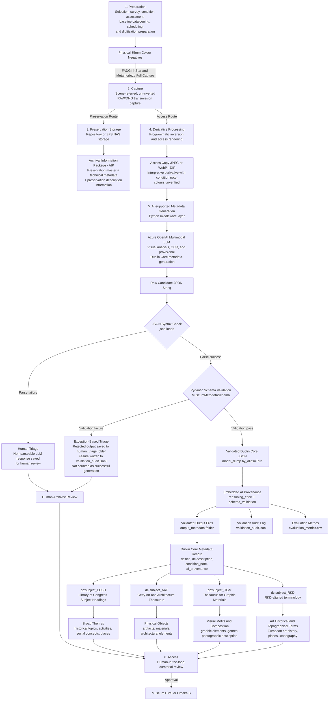

# 🏛️ Museum Archival AI Pipeline: Automated Metadata Generation

**Author:** YIN Renlong (KU Leuven)  
**Course:** Digital Cultural Heritage [F0YS9a]  

## 📖 Executive Summary
This repository contains the Proof of Concept (PoC) for the automated metadata generation pipeline discussed in my course paper. When digitizing massive archival collections (e.g., 100,000 cut 35mm color negatives), capturing "Scene-Referred" optical data successfully preserves the physical media but inadvertently creates a "Dark Archive." Without descriptive metadata, the collection is invisible to public search.

This Python-based middleware solves the 8,000-hour human cataloging bottleneck by orchestrating Multimodal Large Language Models (LLMs) to automatically generate structured, schema-compliant **Dublin Core** visual annotations.

## 🏗️ Architectural Shift: Why Multimodal LLMs?
Traditional museum workflows relied on specialized, narrow Vision APIs. However, as of early 2026, [Microsoft officially deprecated Azure Image Analysis](https://learn.microsoft.com/en-us/azure/ai-services/computer-vision/migration-options), recommending enterprise clients migrate to Generative AI. 

Following this industry standard, this pipeline utilizes the **Azure OpenAI API (GPT-5.5 class)**. Unlike narrow AI, Multimodal LLMs possess zero-shot reasoning, allowing them to understand historical context, extract native OCR, and map outputs directly to institutional JSON schemas via strict Prompt Engineering.


# The Flowchart




# 📊 AI Reasoning Resource Implications

This table dynamically calculates the Token Usage, Financial Cost, and Processing Time based on the image resolution and OpenAI's Reasoning parameters.

| Reasoning Effort | Avg Time/Image | Prompt Tokens | Completion Tokens | Avg Cost/Image | Extrapolated 100k Cost | Extrapolated 100k Time |
|------------------|----------------|---------------|-------------------|----------------|------------------------|------------------------|
| **NONE** | 8.17s | 1128 | 285 | $0.01420 | **$1,420.12** | 227 hours |
| **MEDIUM** | 10.79s | 1128 | 278 | $0.01401 | **$1,400.62** | 300 hours |
| **HIGH** | 11.12s | 1128 | 385 | $0.01722 | **$1,721.62** | 309 hours |

### 📊 Raw Benchmarking Data
Below is the raw telemetry data logged by the asynchronous Python pipeline during the evaluation phase:

```csv
Filename,Resolution,Reasoning_Effort,Time_Seconds,Prompt_Tokens,Completion_Tokens,Total_Cost_USD
img_demo4.jpg,1280x853,none,7.54,1179,267,0.013904999999999999
img_demo4.jpg,1280x853,medium,11.17,1179,260,0.013694999999999999
img_demo4.jpg,1280x853,high,10.85,1179,295,0.014745
img_demo2.jpg,1280x853,none,11.86,1179,302,0.014955
img_demo2.jpg,1280x853,medium,12.9,1179,264,0.013815
img_demo2.jpg,1280x853,high,12.51,1179,353,0.016485
img_demo3.jpg,1280x853,none,6.62,1179,278,0.014235
img_demo3.jpg,1280x853,medium,12.22,1179,269,0.013964999999999998
img_demo3.jpg,1280x853,high,9.89,1179,391,0.017625000000000002
img_demo1.jpg,1280x1024,none,6.65,978,294,0.01371
img_demo1.jpg,1280x1024,medium,6.85,978,322,0.01455
img_demo1.jpg,1280x1024,high,11.22,978,504,0.02001
```


## 🔎 Iterative Development & Example Outputs

During the development of this PoC, the metadata generation pipeline went through two major iterations based on archival feedback and prompt-engineering tests. 


### **Version 3.0: Pydantic Middleware Validation and Exception-Based Triage (Current Version)**

Version 3.0 introduces a critical architectural upgrade to the metadata pipeline: the system no longer treats syntactically valid LLM-generated JSON as automatically trustworthy museum metadata. Instead, every Azure OpenAI response is routed through a deterministic Python middleware layer using **Pydantic v2** before it can be saved as a successful output.

This is a central architectural distinction in the project:

> The prompt requests structured metadata, but Pydantic enforces structured metadata.

The LLM is still instructed to return Dublin Core JSON, but the Python pipeline independently verifies whether the response conforms to the required institutional schema. This protects the downstream museum Collection Management System (CMS) from schema drift, such as a subject field being returned as a string instead of a list.

---

#### **Why Pydantic Validation Was Added**

Earlier versions of the pipeline used `json.loads()` to parse the LLM output. However, valid JSON syntax does not guarantee valid museum metadata structure.

For example, this is valid JSON:

```json
{
    "dc:subject_LCSH": "Bicycle touring"
}
```

But it is structurally invalid for this project, because `dc:subject_LCSH` must be a list of strings:

```json
{
    "dc:subject_LCSH": [
        "Bicycle touring"
    ]
}
```

Version 3.0 solves this problem by validating the parsed JSON against a strict Pydantic schema before saving the file.

---

#### **Validated Museum Metadata Schema**

The Pydantic model `MuseumMetadataSchema` enforces the following required structure:

| JSON Key          | Required Type | Description                                       |
| ----------------- | ------------- | ------------------------------------------------- |
| `dc:identifier`   | `str`         | Source image filename or archival identifier      |
| `dc:title`        | `str`         | Provisional descriptive title                     |
| `dc:description`  | `str`         | Objective visual description                      |
| `dc:subject_LCSH` | `List[str]`   | Library of Congress Subject Headings              |
| `dc:subject_AAT`  | `List[str]`   | Getty Art & Architecture Thesaurus terms          |
| `dc:subject_TGM`  | `List[str]`   | Thesaurus for Graphic Materials terms             |
| `dc:subject_RKD`  | `List[str]`   | RKD-aligned art historical or topographical terms |
| `condition_note`  | `str`         | Archival condition and color reliability note     |
| `ai_provenance`   | `dict`        | AI generation and validation provenance           |

Because Dublin Core keys contain colons, such as `dc:title`, they cannot be used directly as Python variable names. The pipeline therefore uses Pydantic aliases:

```python
dc_title: StrictStr = Field(alias="dc:title")
```

After validation, the model is exported with the original Dublin Core keys:

```python
model_dump(by_alias=True)
```

This allows the Python code to remain valid while preserving museum-facing JSON keys such as `dc:title`, `dc:description`, and `dc:subject_LCSH`.

---

#### **Exception-Based Triage Mechanism**

Version 3.0 implements a two-stage validation workflow:

```text
Azure OpenAI multimodal response
        |
        v
Raw LLM response string
        |
        v
json.loads()
        |
        |--- JSON parsing fails
        |        |
        |        v
        |   human_triage/
        |   validation_audit.jsonl
        |
        v
Pydantic MuseumMetadataSchema validation
        |
        |--- validation passes
        |        |
        |        v
        |   output_metadata/
        |   validation_audit.jsonl
        |   evaluation_metrics.csv
        |
        |--- validation fails
                 |
                 v
            human_triage/
            validation_audit.jsonl
```

This means that structurally flawed metadata is not silently accepted. Instead, it is automatically caught and routed to human review.

If validation passes:

- the validated JSON is saved to `output_metadata/`;
- a successful validation event is written to `validation_audit.jsonl`;
- Pydantic validation provenance is embedded inside `ai_provenance`;
- the item is logged in `evaluation_metrics.csv`.

If validation fails:

- the output is not saved as successful metadata;
- the item is not logged as a successful CSV generation;
- the raw rejected output and validation errors are saved to `human_triage/`;
- the failure is recorded in `validation_audit.jsonl`.

This implements **Exception-Based Triage**: invalid machine output becomes a review case rather than a successful CMS-ready record.

---

#### **Validation Evidence and Audit Trail**

Version 3.0 records validation evidence in several locations:

| Location                 | Purpose                                                      |
| ------------------------ | ------------------------------------------------------------ |
| `output_metadata/*.json` | Contains only Pydantic-validated metadata records            |
| `human_triage/*.json`    | Contains rejected LLM outputs and validation error details   |
| `validation_audit.jsonl` | Machine-readable log of validation pass/fail events          |
| `evaluation_metrics.csv` | Token, timing, and cost data for successful validated records |
| `evaluation_summary.md`  | Summary of resource implications for successful records      |

A successful validation event is also embedded directly inside the metadata JSON under `ai_provenance.schema_validation`.

This creates both:

1. a self-describing metadata file; and  
2. an external validation audit trail.

---

#### **Example Version 3.0 Validated Output**

The following example shows a Version 3.0 output file that successfully passed Pydantic validation.

**File:** `img_demo1_high.json`

```json
{
    "dc:identifier": "img_demo1.jpg",
    "dc:title": "Traveler with loaded bicycle on shaded wooded road",
    "dc:description": "A full-length view of an adult standing on a pale unpaved road beneath a dense canopy of trees. The person's face is obscured; they wear a sleeveless dark top, cropped trousers, socks, and low shoes. To the right, a bicycle with attached bags and gear leans against vegetation near a chain-link fence. A white sign on the fence reads: \"PROPRIETÀ UNIVERSITÀ AGRARIA DI ISOLA FARNESE.\" The road is bordered by earthen banks and thick foliage, with dappled sunlight, fallen leaves, and the road receding into the shaded distance.",
    "dc:subject_LCSH": [
        "Bicycle touring",
        "Roads",
        "Forests and forestry",
        "Outdoor recreation"
    ],
    "dc:subject_AAT": [
        "bicycles",
        "panniers",
        "roads",
        "fences",
        "signs",
        "trees"
    ],
    "dc:subject_TGM": [
        "Bicycles & tricycles",
        "Roads",
        "Trees",
        "Signs (Notices)",
        "Portrait photographs",
        "Landscape photographs"
    ],
    "dc:subject_RKD": [
        "landscape",
        "wooded landscape",
        "road",
        "traveller",
        "bicycle",
        "Italy"
    ],
    "condition_note": "Colors unverified; image programmatically inverted from faded source negative.",
    "ai_provenance": {
        "reasoning_effort": "HIGH",
        "schema_validation": {
            "status": "passed",
            "validator": "pydantic",
            "pydantic_version": "2.11.7",
            "schema": "MuseumMetadataSchema",
            "schema_version": "1.0.0",
            "validated_at_utc": "2026-06-13T07:56:02Z"
        }
    }
}
```

The `schema_validation` block confirms that the output was not merely generated by the LLM, but also checked by the Python middleware layer before being saved.

---

#### **Example Validation Audit Record**

In addition to embedding validation provenance inside the output JSON, the pipeline writes an external audit record to `validation_audit.jsonl`.

A successful validation record looks like this:

```json
{"timestamp_utc":"2026-06-13T07:56:02Z","filename":"img_demo1.jpg","reasoning_effort":"high","status":"passed","validator":{"name":"pydantic","version":"2.11.7"},"schema":{"name":"MuseumMetadataSchema","version":"1.0.0"}}
```

If validation fails, the audit log records the error and links to the triage file:

```json
{"timestamp_utc":"2026-06-13T08:01:14Z","filename":"img_demo2.jpg","reasoning_effort":"high","status":"failed","validator":{"name":"pydantic","version":"2.11.7"},"schema":{"name":"MuseumMetadataSchema","version":"1.0.0"},"errors":[{"type":"list_type","loc":["dc:subject_LCSH"],"msg":"Input should be a valid list"}],"triage_file":"human_triage/img_demo2_high_schema_validation_failed.json"}
```

This gives the pipeline a durable, machine-readable validation history suitable for academic evaluation and museum workflow accountability.

---

#### **Important Limitation**

Pydantic validation guarantees **structural correctness**, not curatorial truth.

It can verify that:

- required fields are present;
- `dc:title` is a string;
- `dc:subject_LCSH` is a list of strings;
- `ai_provenance` is a dictionary;
- unexpected top-level fields are rejected.

However, Pydantic does not independently verify whether every vocabulary term is genuinely authorized by LCSH, Getty AAT, TGM, or RKD. Therefore, Version 3.0 should be understood as a **schema-safety layer**, not as a replacement for professional archival judgment.

The final workflow remains human-in-the-loop:

```text
LLM generation
        |
        v
Pydantic schema validation
        |
        v
Human curatorial review
        |
        v
Museum CMS / Omeka S ingestion
```

In this architecture, the LLM acts as a high-speed metadata generation layer, Pydantic acts as a deterministic structural safety gate, and the human archivist remains responsible for final curatorial approval.


### Version 2.0: The GLAM-Optimized Pipeline

Based on feedback regarding institutional standards, the system prompt was heavily upgraded to force the LLM's "High" reasoning engine to separate visual data into four distinct, formal GLAM ontologies. Additionally, an archival condition_note was injected to manage the ethical implications of color-shifting in digitized negatives.

**Notice three major academic achievements in this output:**

1. **Semantic Separation:** The LLM successfully separates abstract themes (LCSH), physical objects (AAT), and compositional tags (TGM).
2. **Multilingual Ontology Mapping:** Without being prompted for translation, the LLM recognized that the RKD database is Dutch, automatically translating visual concepts into native Dutch art-historical terms (e.g., *stadsgezicht*, *koepel*).
3. **Dynamic Thresholding:** Rather than keyword-stuffing, the AI naturally constrained itself to 4–5 highly confident terms per vocabulary, ensuring search database precision.


```
{
    "dc:identifier": "img_demo2.jpg",
    "dc:title": "Street view beside fortified wall and domed church",
    "dc:description": "Urban street scene photographed from a low viewpoint behind a bicycle or scooter handlebar and saddle in the foreground. A paved roadway curves alongside a high stone defensive wall with crenellations at the upper left. Behind the wall and adjacent buildings, a church dome with a lantern rises above the roofline. Several automobiles and a small van travel or are parked along the road, and a pedestrian is visible near the wall. On the right side are a sidewalk, trees, streetlights, modern buildings, and an outdoor seating area. The scene combines historic masonry architecture with contemporary street infrastructure.",
    "dc:subject_LCSH": [
        "City and town life",
        "Historic buildings",
        "Church architecture",
        "Fortification",
        "Urban transportation"
    ],
    "dc:subject_AAT": [
        "streets",
        "city walls",
        "crenellations",
        "domes",
        "churches",
        "automobiles",
        "bicycles",
        "streetlights"
    ],
    "dc:subject_TGM": [
        "Street scenes",
        "Cityscapes",
        "Fortifications",
        "Churches",
        "Automobiles",
        "Trees",
        "Color photographs"
    ],
    "dc:subject_RKD": [
        "stadsgezicht",
        "kerkarchitectuur",
        "vestingmuur",
        "koepel",
        "straatbeeld"
    ],
    "condition_note": "Colors unverified; image programmatically inverted from faded source negative.",
    "ai_provenance": {
        "reasoning_effort": "HIGH"
    }
}
```


```csv
{
    "dc:identifier": "img_demo3.jpg",
    "dc:title": "Loaded touring bicycle beside guardrail in agricultural landscape",
    "dc:description": "A loaded touring bicycle is parked in the foreground against a metal roadside guardrail. The bicycle carries rear panniers, a rolled sleeping pad or mat secured to the front, multiple water bottles, and additional bags attached to the frame and rack. Behind the guardrail is an open harvested field with low vegetation, pale exposed earth mounds, distant rolling hills, and a broad sky with thin clouds. No people are visible.",
    "dc:subject_LCSH": [
        "Bicycle touring",
        "Cycling",
        "Rural landscapes",
        "Agricultural landscapes"
    ],
    "dc:subject_AAT": [
        "bicycles",
        "panniers",
        "guardrails",
        "water bottles"
    ],
    "dc:subject_TGM": [
        "Bicycles & tricycles",
        "Fields",
        "Hills",
        "Landscape photographs"
    ],
    "dc:subject_RKD": [
        "landscape",
        "rural landscape",
        "hilly landscape",
        "bicycle"
    ],
    "condition_note": "Colors unverified; image programmatically inverted from faded source negative.",
    "ai_provenance": {
        "reasoning_effort": "HIGH"
    }
}

```


```csv
{
    "dc:identifier": "img_demo1.jpg",
    "dc:title": "Person with loaded bicycle on shaded rural road near Isola Farnese",
    "dc:description": "A person stands near the center of a sunlit dirt or gravel road bordered by dense trees and undergrowth. The person's face is obscured or blurred; they wear a sleeveless top, cropped trousers, socks, and shoes. To the right, a bicycle is parked against vegetation and appears fitted with bags and travel equipment. A chain-link fence and a posted sign are visible on the right side; the sign includes Italian text reading in part, \"PROPRIET\u00c0 UNIVERSIT\u00c0 AGRARIA DI ISOLA FARNESE.\" The road recedes into a shaded tree-lined passage, with strong contrasts between sunlight and shadow across the foreground.",
    "dc:subject_LCSH": [
        "Roads",
        "Cycling",
        "Forests and forestry",
        "Travel"
    ],
    "dc:subject_AAT": [
        "bicycles",
        "panniers",
        "roads",
        "fences",
        "signs (declaratory or advertising artifacts)"
    ],
    "dc:subject_TGM": [
        "Roads",
        "Trees",
        "Bicycles & tricycles",
        "Signs (Notices)",
        "Portrait photographs"
    ],
    "dc:subject_RKD": [
        "landscape",
        "wooded landscape",
        "road",
        "Italy",
        "Isola Farnese"
    ],
    "condition_note": "Colors unverified; image programmatically inverted from faded source negative.",
    "ai_provenance": {
        "reasoning_effort": "HIGH"
    }
}
```


```csv
{
    "dc:identifier": "img_demo4.jpg",
    "dc:title": "Touring bicycle beside rural road",
    "dc:description": "Landscape-oriented color photograph showing a paved two-lane rural road receding toward the horizon. A loaded touring bicycle with panniers and gear is parked at the left shoulder, leaning against a metal guardrail beside a concrete retaining wall. Dry roadside grasses, shrubs, fence posts, and open fields line the road, with low hills or mountains visible in the distance beneath a mostly clear sky. No people or moving vehicles are visible.",
    "dc:subject_LCSH": [
        "Cycling",
        "Roads",
        "Rural transportation",
        "Landscapes"
    ],
    "dc:subject_AAT": [
        "bicycles",
        "panniers",
        "guardrails",
        "retaining walls",
        "roads"
    ],
    "dc:subject_TGM": [
        "Bicycles & tricycles",
        "Roads",
        "Guardrails",
        "Landscape photographs"
    ],
    "dc:subject_RKD": [
        "landscape",
        "road in landscape",
        "mountain landscape",
        "bicycle"
    ],
    "condition_note": "Colors unverified; image programmatically inverted from faded source negative.",
    "ai_provenance": {
        "reasoning_effort": "HIGH"
    }
}

```


### Version 1.0: The Baseline Prototype

The initial prompt successfully extracted visual context but suffered from two archival flaws: it utilized generic "commercial" photography tags (e.g., "travel photography"), and a hard-coded provenance bug caused the AI to misreport its own reasoning effort.


```json
{
    "dc:identifier": "img_demo3.jpg",
    "dc:title": "Loaded touring bicycle beside a rural field",
    "dc:description": "A color photograph shows a touring bicycle parked in the foreground against a metal roadside guardrail. The bicycle is heavily outfitted for travel, with front and rear racks, panniers, a rolled sleeping mat, water bottles, and additional bags secured with straps and cords. Behind the road barrier stretches a dry golden agricultural landscape, likely harvested grain fields, with low hills, scrubby vegetation, and pale exposed earth formations in the middle distance. The sky is clear blue with light wisps of cloud, suggesting bright daytime conditions in a rural or semi-arid countryside setting.",
    "dc:subject": [
        "touring bicycle",
        "bicycle travel",
        "cycle touring",
        "roadside",
        "guardrail",
        "panniers",
        "camping gear",
        "rural landscape",
        "agricultural fields",
        "wheat field",
        "hills",
        "summer",
        "outdoor recreation",
        "travel photography"
    ],
    "ai_provenance": {
        "reasoning_effort": "medium"
    }
}
```


```json
{
    "dc:identifier": "img_demo4.jpg",
    "dc:title": "Touring bicycle beside a rural road",
    "dc:description": "Color photograph of a two-lane paved road receding into the distance through a dry rural landscape. In the left foreground, a loaded touring bicycle with panniers and gear is leaned against a metal guardrail beside a concrete retaining wall. Low shrubs and trees line the roadside, with fence posts and fields on the right and hazy hills or mountains visible in the background under a pale blue sky. The scene suggests a roadside stop during long-distance bicycle travel.",
    "dc:subject": [
        "touring bicycle",
        "rural road",
        "guardrail",
        "roadside",
        "cycling",
        "travel",
        "landscape",
        "dry vegetation",
        "hills",
        "paved road"
    ],
    "ai_provenance": {
        "reasoning_effort": "medium"
    }
}
```


## 💡 Key Academic Insights

1. **Metadata Dilution vs. Dynamic Thresholding:** A deliberate architectural decision was made to not constrain the LLM to a specific quota of metadata tags (e.g., forcing 8-10 keywords). Forcing a static quota inadvertently causes 'Metadata Dilution' (keyword stuffing), where the model hallucinates generic descriptors to fulfill the prompt, thereby destroying the precision of the museum's search database. By allowing the 'High' reasoning model to dynamically determine the array length, the AI naturally thresholded its outputs to 4-5 highly specific, confident terms, ensuring maximum search relevance.
2. **Multilingual Ontology Mapping:** Deploying the 'High' reasoning parameter revealed extraordinary multilingual capabilities. When instructed to output terms matching the RKD classification, the Multimodal LLM automatically cross-translated the English visual context into native Dutch art-historical terminology (e.g., identifying a 'dome' as 'koepel'). This proves LLMs can seamlessly normalize global collections into localized regional CMS databases.
3. **The "Medium" Reasoning Sweet Spot:** Empirical testing revealed that "Medium" reasoning was actually *cheaper* at scale than "None." Zero-shot models (None) compensated for their lack of reasoning by generating overly verbose descriptions (inflating Completion Tokens).
4. **Mitigating Prompt-Induced Hallucinations:** When processing inverted Access Copies (DIPs), the "None" model blindly adhered to the system prompt, hallucinating the words "color negative" into positive images. Activating "Medium" or "High" reasoning allowed the model's internal Chain-of-Thought to override the prompt bias and correctly identify the asset type.
5. **Provenance & Human-in-the-Loop:** All generated metadata is automatically tagged as pending_human_review. LLMs act as a high-speed triage layer, but institutional integrity requires a final human audit before CMS ingestion.

## 🚀 How to Run Locally
1. Clone the repository and install dependencies: `pip install -r requirements.txt`
2. Add your Azure credentials to a `.env` file (DO NOT commit this file).
3. Place sample JPEGs in `/input_images`
4. Run the asynchronous batch processor: `python batch_processor.py`
